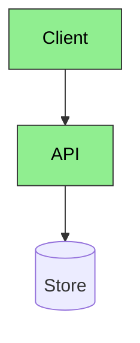

# GitHub wiki, WikiTicket SDD, and Confluence

TOKEN_BUDGET: 480
LOAD_TRIGGER: WikiTicket design docs, GitHub wiki, architecture Markdown, code walkthroughs, requirements, Confluence

## Why this guide exists

GitHub Flavored Markdown and GitHub wiki render fenced `mermaid` blocks.
They do not render PlantUML source. Confluence does not reliably render
either. WikiTicket SDD publishes `docs/designs/` and related docs to the
configured wiki.

## Default: Mermaid

This skill draws every GitHub-safe diagram:

- flowchart / activity
- sequence
- class (`classDiagram`)
- ER (`erDiagram`)
- state (`stateDiagram-v2`)
- C4 context / container / component
- component and deployment views as flowcharts when C4 is flaky on GitHub

Do not send class, ER, state, or component diagrams to PlantUML for wiki
docs. Mermaid already does those.

## PlantUML is opt-in

Call `plantuml` only for:

- Salt wireframes
- use case
- timing
- ArchiMate
- nwdiag / WBS / JSON-YAML trees
- a Confluence or Word image when the user already has `.puml` source

Always render PlantUML to PNG or SVG. Always link the image. Always upload
the image with the wiki or Confluence page.

## Companion skills

| Need | Skill |
|------|--------|
| Prose (STE100 default) | `document-specialist` |
| Every GitHub-safe diagram, including class / ER / state / component | this skill |
| Wireframe, use case, timing, ArchiMate, leftover UML | `plantuml` |

Do not mix STE100 and Google style in one document.

## Reliability rules

1. Derive nodes from code, config, or events. Do not invent services.
2. Cap a diagram at about 16 nodes. Write `+N more` instead of silent truncation.
3. Prefer `flowchart TD`, `sequenceDiagram`, `classDiagram`, `erDiagram`, `stateDiagram-v2`.
4. Quote reserved words in node ids (`end`, `default`).
5. Every `classDef` must set `color:`. Light fill needs dark text.
6. Validate with `scripts/resilient_diagram.py` or `mmdc` before commit.
7. Keep a `.mmd` source under `docs/diagrams/` for recovery.
8. Wiki: embed the fenced Mermaid block so GitHub renders it.
9. Confluence: also render PNG or SVG and upload. Do not ship a mermaid fence as the only Confluence view.

## GitHub-safe pattern



Avoid `click` handlers, `init` frontmatter, unquoted `end`, and subgraphs
deeper than two levels.

## Layout

```
docs/designs/current_design_doc.md          # fenced mermaid in place
docs/designs/current_code_walkthrough.md
docs/diagrams/<doc>_<num>_<type>_<title>.mmd
docs/diagrams/<doc>_<num>_<type>_<title>.png   # required for Confluence; optional wiki fallback
```
