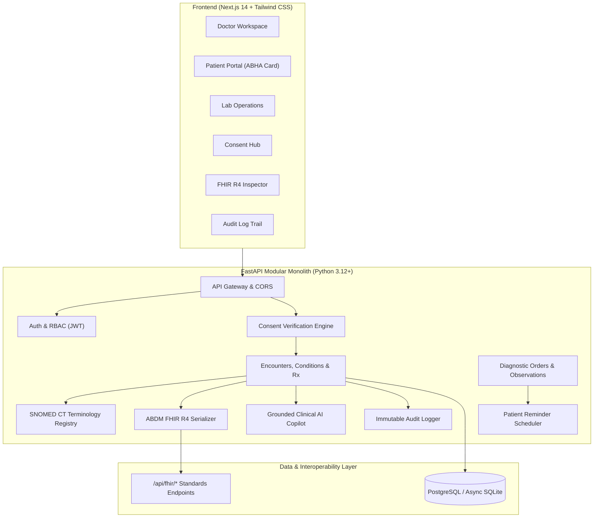

# MedIndia HealthOS — Production-Quality EHR Prototype

[](#abdm--fhir-r4-interoperability)
[](#abdm--fhir-r4-interoperability)
[](#snomed-ct-clinical-terminology)
[](#system-architecture)

> A modern, secure, consent-driven Electronic Health Record (EHR) platform engineered for India's digital healthcare ecosystem, demonstrating sound clinical informatics architecture, ABDM alignment, standardized FHIR R4 interoperability, SNOMED CT clinical coding, first-class consent governance, immutable auditability, automated reminders, and grounded clinical AI decision support.

---

## 🏛️ System Architecture

MedIndia HealthOS adopts a **3-Layer Architecture** (`Agents.md`) combined with a **Modular Monolith** backend to maximize reliability, maintainability, and domain isolation.



---

## 🌟 Key Features

### 1. ABDM & FHIR R4 Interoperability
* Internal relational database schemas are cleanly decoupled from external interoperability transfer models.
* Standards-compliant FHIR R4 resource serializers with support for:
  * `Patient` (ABHA ID identifier system: `https://healthid.abdm.gov.in`)
  * `Practitioner` (NMC registration identifier system: `https://doctor.nmc.org.in`)
  * `Encounter` (Ambulatory and consultation classification)
  * `Condition` (Diagnosis with standard SNOMED CT coding)
  * `Observation` (Quantitative and qualitative lab values with reference ranges)
  * `DiagnosticReport` (Lab test panel summary and specialist conclusion)
  * `MedicationRequest` (Prescription orders with dosageInstructions)
  * `Consent` (ABDM consent artifact with purpose and validity period)
* Native REST FHIR query endpoints available at `/api/fhir/*`.

### 2. SNOMED CT Clinical Terminology
* Integrated clinical terminology registry containing verified, authentic SNOMED CT codes (`http://snomed.info/sct`).
* Eliminates fabricated diagnostic codes. Includes concepts for Type 2 Diabetes Mellitus (`44054006`), Essential Hypertension (`59621000`), Dengue Fever (`38362002`), Asthma (`195967001`), and standard procedures.
* Search and auto-complete endpoint at `/api/v1/terminology/snomed/search`.

### 3. First-Class Consent Gating
* Consent is enforced as a **mandatory backend authorization barrier** (not just a frontend toggle).
* Patients control:
  * Which doctor receives access
  * Specific clinical categories (`ALL_RECORDS`, `DIAGNOSTIC_REPORT`, `PRESCRIPTION`, `CONDITION`)
  * Purpose of care (`CONSULTATION`, `CARE_MANAGEMENT`, `SECOND_OPINION`, `EMERGENCY`)
  * Time-bound validity window (automatic expiration)
* Instant 1-click revocation by the patient immediately terminates clinician access.
* Unauthorized access attempts return HTTP 403 Forbidden and are permanently recorded in the security audit log.

### 4. Grounded AI Clinical Decision Support
* **Strict Anti-Hallucination Grounding**: The AI assistant acts strictly as a clinical decision support copilot over structured patient EHR records.
* **Clinical Summary**: Synthesizes active diagnoses, current medications, allergies, and recent laboratory investigations.
* **Grounded History Q&A**: Answers clinician inquiries citing explicit underlying record IDs (`[Condition#12]`, `[Obs#4]`).
* **Lab Value Explainer**: Translates numerical laboratory markers into plain language for patients, complete with mandatory medical disclaimers.

### 5. Automated Patient Reminders & Notification Center
* Event-driven reminder pipeline generating actionable patient notifications for:
  * Available laboratory test results
  * Prescribed medication intake schedules
  * Scheduled consultations and follow-up reviews
* Extensible architecture ready for Redis/Celery/BullMQ production workers.

### 6. Transparent Immutable Audit Trail
* Every sensitive patient record access, consent grant, revocation, and diagnostic entry produces an immutable audit log detailing:
  * Actor ID & Role (`PATIENT`, `DOCTOR`, `LAB`, `SYSTEM`)
  * Target Patient ID
  * Consent ID & Purpose attached
  * Action timestamp & status (`SUCCESS` or `DENIED`)

---

## 👥 Demo Personas & Credentials

The system includes pre-seeded, realistic Indian healthcare test data:

| Role | Name / Facility | Email | Password | Identifier |
|---|---|---|---|---|
| **Doctor** | Dr. Arvind Swaminathan, MD | `dr.arvind@apollo.in` | `Doctor123!` | NMC Reg: `MCI-74892` (Apollo Hospitals) |
| **Patient 1** | Rajesh Sharma | `rajesh.sharma@example.in` | `Password123!` | ABHA: `91-4405-2026-0001` (Diabetes, HTN) |
| **Patient 2** | Priya Patel | `priya.patel@example.in` | `Password123!` | ABHA: `91-3836-2026-0002` (Dengue Follow-up) |
| **Laboratory** | Dr. Lal PathLabs National Ref Lab | `delhi.lab@lalpathlabs.com` | `Lab12345!` | NABL Lic: `NABL-DL-2026-891` |

---

## 🚀 Quickstart & Running Locally

### Prerequisites
* Python 3.10+
* Node.js 18+ and npm
* Docker (optional, for full containerized deployment)

### Option A: 1-Command Local Dev (Recommended)
```powershell
# 1. Activate virtual environment
.venv\Scripts\activate

# 2. Launch both backend & frontend concurrently
python execution/run_dev.py
```
* **Frontend Portal**: [http://localhost:3000](http://localhost:3000)
* **Backend API**: [http://localhost:8000](http://localhost:8000)
* **Interactive OpenAPI Docs**: [http://localhost:8000/docs](http://localhost:8000/docs)

### Option B: Docker Compose
```bash
docker compose up --build
```

---

## 🧪 Automated Verification Suite

Run the deterministic test suite to validate all 12 backend integration checkpoints:
```powershell
.venv\Scripts\python execution/verify_backend_api.py
```
Verifies:
1. Health Endpoint (`/api/health`)
2. Doctor Authentication & JWT
3. Patient ABHA Authentication
4. Laboratory Staff Authentication
5. Doctor Authorized Patient Roster
6. Consent-Gated Longitudinal Timeline Access
7. SNOMED CT Terminology Search
8. ABDM FHIR R4 Patient Serialization
9. AI Grounded Clinical Summary Generation
10. AI Grounded EHR History Retrieval
11. Patient Transparency Audit Trail Logging
12. Security Barrier (Rejection of Unauthorized Requests)

---

## 📁 Repository Structure
```text
EHR Task/
├── .agents/skills/                 # 22 specialized agent skills
├── backend/                        # Modular Monolith FastAPI backend
│   ├── app/
│   │   ├── api/
│   │   │   ├── v1/                 # REST endpoints (auth, patients, doctors, labs, consent, etc.)
│   │   │   ├── fhir/               # ABDM FHIR R4 endpoints
│   │   │   └── router.py           # Master router
│   │   ├── core/                   # Security, async database engine, audit logger, config
│   │   ├── fhir/                   # FHIR R4 resource serializers
│   │   ├── models/                 # SQLAlchemy relational domain models
│   │   ├── schemas/                # Pydantic validation schemas
│   │   ├── services/               # Clinical AI service, reminder scheduler
│   │   ├── terminology/            # SNOMED CT clinical terminology catalog
│   │   └── main.py                 # FastAPI application & lifespan
│   ├── Dockerfile
│   └── requirements.txt
├── frontend/                       # Modern Next.js 14 + Tailwind CSS frontend
│   ├── src/app/
│   │   ├── globals.css             # Healthcare design system styles
│   │   ├── layout.tsx              # Root HTML layout
│   │   └── page.tsx                # Interactive multi-role clinical workspace
│   ├── Dockerfile
│   └── package.json
├── directives/                     # Layer 1: SOPs (Standard Operating Procedures)
├── execution/                      # Layer 3: Deterministic Python tools
│   ├── seed_demo_data.py           # Clinical scenario seeder
│   ├── run_dev.py                  # Concurrent dev server runner
│   ├── verify_backend_api.py       # 12-point automated verification suite
│   └── verify_env.py               # Toolchain validator
├── docker-compose.yml              # Multi-container deployment configuration
└── README.md
```
