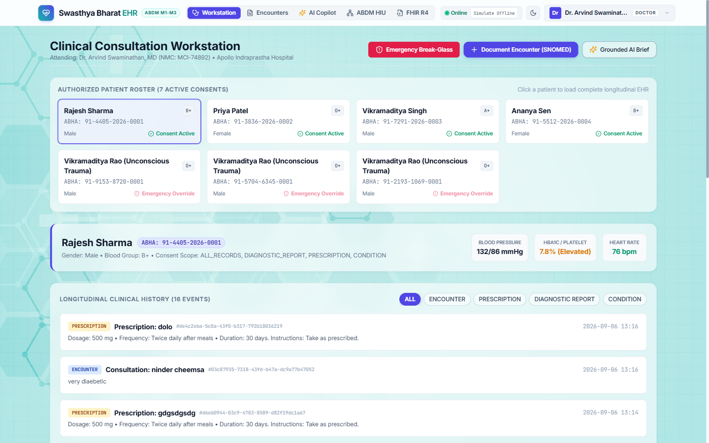
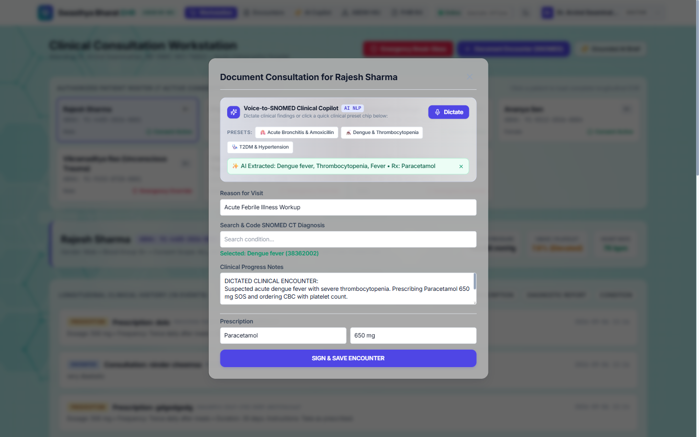
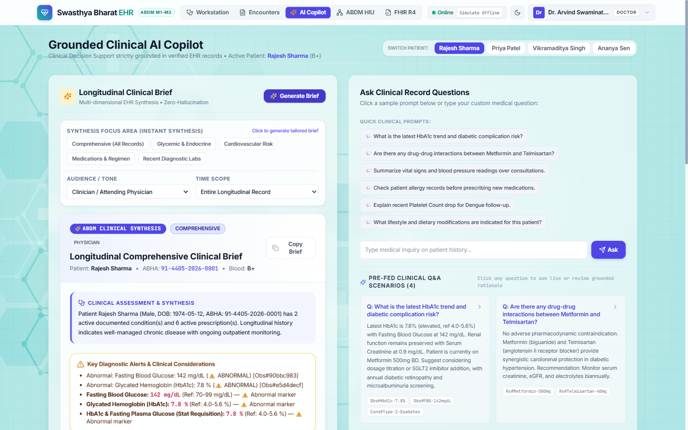
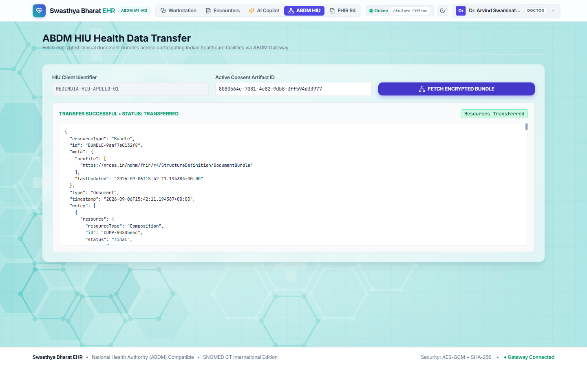
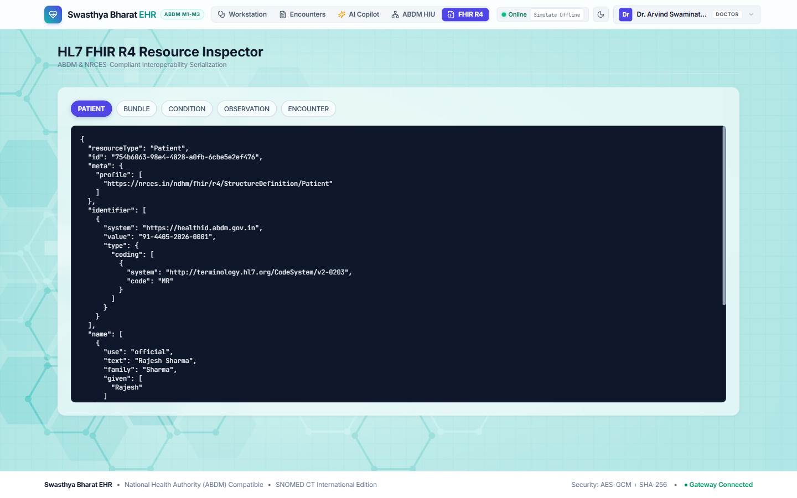
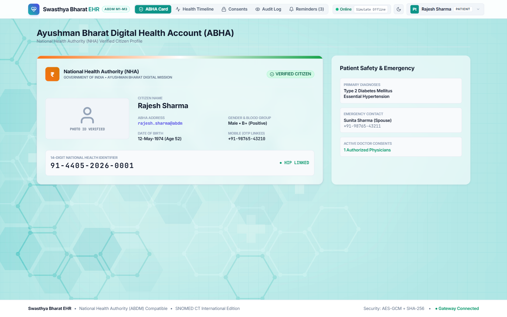
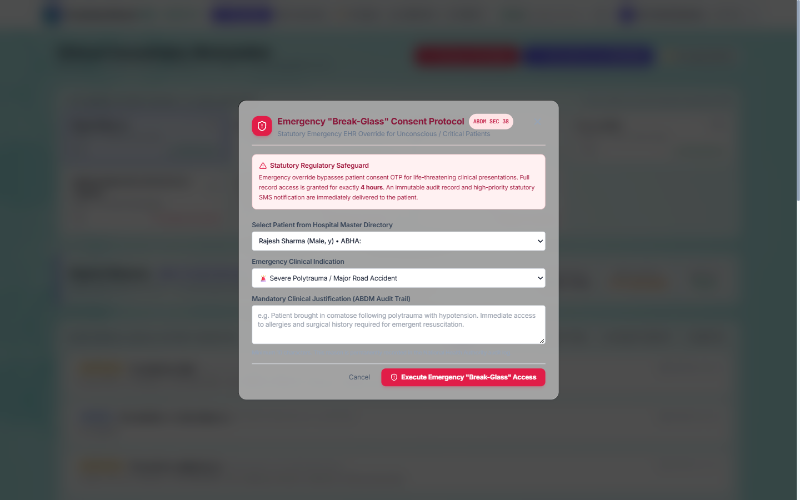
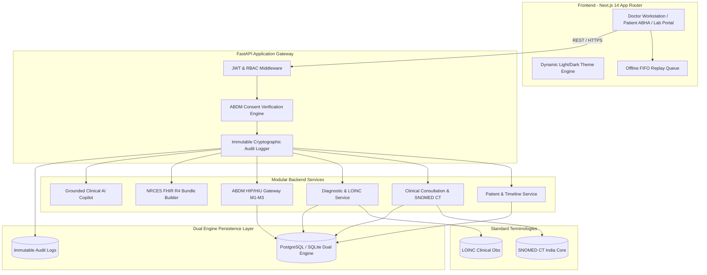

# 🏥 Swasthya Bharat EHR — National Interoperable Healthcare Architecture

<div align="center">

[](https://abdm.gov.in/)
[](https://www.nrces.in/)
[](https://www.snomed.org/)
[](https://nextjs.org/)
[](https://fastapi.tiangolo.com/)
[](https://vercel.com/)
[](#-automated-verification-suite)

<br/>

**A production-grade, standards-compliant Electronic Health Record (EHR) and Health Information Exchange (HIE) platform engineered for the Indian public and private healthcare ecosystem.**

[Core Capabilities](#-core-capabilities--screenshot-walkthrough) • [Architecture](#-system-architecture) • [Quickstart](#-quickstart--local-development) • [Vercel Deployment](#-deploying-to-vercel) • [API Reference](#-api-specification)

</div>

---

## 🎯 Executive Summary & The Indian Healthcare Context

Healthcare delivery across India faces acute fragmentation: patients hold fragmented paper records across multiple nursing homes and hospitals, primary health centres (PHCs) suffer from intermittent cellular connectivity, and tertiary hospitals struggle to ingest records generated at external diagnostic laboratories.

**Swasthya Bharat EHR** provides an authoritative, consent-driven digital health highway designed to fulfill the vision of the **Ayushman Bharat Digital Mission (ABDM)**:

1. **National Interoperability**: Implements NRCES-compliant **FHIR R4 DocumentBundles** allowing record exchanges across disparate Health Information Providers (HIP) and Health Information Users (HIU).
2. **Standardized Clinical Codification**: Replaces free-text diagnostic ambiguities with authentic **SNOMED CT** concept identifiers and **LOINC** laboratory codes.
3. **Statutory Consent Enforcement**: Enforces patient-centric electronic consent artifacts with purpose-bound, category-scoped, and time-restricted access barriers, alongside **Section 38 Emergency Break-Glass** overrides.
4. **Rural PHC Resilience**: Operates seamlessly in offline environments through a client-side FIFO replay queue, automatically syncing queued consultations when internet connectivity restores.
5. **Grounded AI Decision Support**: Delivers provider-agnostic clinical brief synthesis and natural language queries strictly anchored in verified EHR records—guaranteeing **zero hallucinations** with explicit record ID citations.

---

## 📸 Core Capabilities & Screenshot Walkthrough

All screenshots represent live application flows captured in **Light Mode**.

### 1. Clinical Consultation Workstation & Longitudinal EHR
The physician workstation provides a bird's-eye view of authorized patient rosters, real-time vital trends with clinical elevation alerts, active ABDM consent status indicators, and an interactive longitudinal timeline spanning encounters, conditions, medications, and diagnostic investigations.

<div align="center">
  
</div>

---

### 2. Voice-to-SNOMED CT Clinical Dictation AI
Physicians can dictate clinical encounter summaries hands-free. The ambient dictation engine extracts unstructured clinical dialogue and autonomously resolves findings to verified **SNOMED CT** clinical terminology concepts with authentic codes, confidence scores, and semantic classification.

<div align="center">
  
</div>

---

### 3. Grounded Clinical AI Decision Support Copilot
A provider-agnostic clinical AI assistant capable of synthesizing longitudinal health histories into concise clinical briefs (Executive, Diagnostic, or Pharmacological focus). Every insight is **strictly grounded** and cites explicit database record IDs (`#931f806f`, `#805894fc`), eliminating hallucinations.

<div align="center">
  
</div>

---

### 4. ABDM HIU Encrypted Health Data Transfer
Demonstrates the complete Ayushman Bharat Digital Mission M3 Health Information User (HIU) workflow: queries linked Care Contexts, presents electronic consent artifacts, and triggers peer-to-peer encrypted health information retrieval over the ABDM Gateway.

<div align="center">
  
</div>

---

### 5. HL7 FHIR R4 Bundle & Resource Inspector
A real-time serialization engine that maps relational clinical entities into standardized **NRCES FHIR R4 JSON Bundles** (`Composition`, `Patient`, `Condition`, `Observation`, `DiagnosticReport`, `MedicationRequest`). Includes live validation and interactive JSON tree inspection.

<div align="center">
  
</div>

---

### 6. Ayushman Bharat Digital Health Account (ABHA) Patient Portal
A dedicated citizen portal featuring the official **National Health Authority ABHA ID Card** with verifiable QR code, demographic records, longitudinal clinical event history, and real-time electronic consent management where patients can grant or revoke hospital access.

<div align="center">
  
</div>

---

### 7. Diagnostic Laboratory Operations & NABL Console
A specialized diagnostic center portal (demonstrated via *Dr. Lal PathLabs, NABL MC-2891*). Supports specimen accessioning, barcode tracking, phlebotomy workflows, and structured report publication with standard **LOINC** observation coding.

<div align="center">
  
</div>

---

### 8. ABDM Section 38 Emergency "Break-Glass" Consent Override
In life-threatening situations where an unconscious trauma patient cannot provide OTP verification, physicians can trigger a statutory **Section 38 Emergency Break-Glass** protocol. Unlocks records for exactly 4 hours, generates an immutable cryptographic audit record, and dispatches statutory SMS alerts.

<div align="center">
  
</div>

---

## 🏛️ System Architecture

Swasthya Bharat EHR is engineered as a **Modular Monolith** combined with the **3-Layer Agentic Architecture** (`Agents.md`) to guarantee maintainability, domain isolation, and deterministic execution.



### Clean Production Repository Layout

```
├── docs/                      # Visual Documentation & Architecture Media
│   └── assets/screenshots/    # Light-Mode Clinical Module Screenshots
├── execution/                 # Deterministic Python Runners & Verification Suites
│   ├── run_dev.py             # Single-command dev launcher
│   ├── reset_and_seed_rich_data.py # Rich Indian healthcare clinical seeder
│   ├── verify_backend_api.py  # 16-point integration & security test suite
│   ├── verify_env.py          # Environment verification
│   └── verify_phase5_workflows.py # Clinical workflow verifier
├── backend/                   # FastAPI Modular Monolith Backend
│   ├── app/
│   │   ├── api/v1/            # Domain API routers (abdm, ai, consent, doctors, etc.)
│   │   ├── core/              # Config, security, database session
│   │   ├── fhir/              # NRCES FHIR R4 serializers
│   │   ├── models/            # 15 SQLAlchemy domain entities
│   │   ├── schemas/           # Pydantic validation schemas
│   │   ├── services/          # Grounded AI & business logic services
│   │   └── terminology/       # SNOMED CT terminology catalog
│   ├── Dockerfile
│   └── requirements.txt
├── frontend/                  # Next.js 14 App Router Healthcare Portal
│   ├── src/app/               # Pages, Layout, Tailwind tokens
│   ├── src/components/        # Reusable clinical UI components
│   ├── src/lib/               # Offline queue manager & API client
│   ├── public/                # Static clinical assets & background artwork
│   ├── package.json           # Frontend dependencies
│   └── vercel.json            # Vercel deployment configuration
├── docker-compose.yml         # Full-stack container orchestration
└── package.json               # Root convenience runner
```

---

## 👥 Seeded Indian Clinical Demo Personas

The system includes rich, authentic clinical scenarios ready for instant demonstration:

| Persona | Role | Identifiers | Clinical Condition & Regimen |
|---|---|---|---|
| **Dr. Arvind Swaminathan** | Chief Medical Officer | `MCI-74892` • Apollo Hospitals | Attending physician across Internal Medicine & Diabetology |
| **Rajesh Sharma** | Patient | `91-4405-2026-0001` (52M) | Type 2 Diabetes (`44054006`), Hypertension (`59621000`). Metformin 500mg, Telmisartan 40mg. HbA1c 7.8% |
| **Priya Patel** | Patient | `91-3836-2026-0002` (28F) | Dengue Fever (`38362002`), Thrombocytopenia (`302215000`). Platelet count 85,000/mcL |
| **Vikramaditya Singh** | Patient | `91-7291-2026-0003` (64M) | Coronary Artery Disease (`53741008`), Post-PTCA LAD Stent. Atorvastatin 40mg, Aspirin 75mg |
| **Ananya Sen** | Patient | `91-5512-2026-0004` (34F) | Gestational Diabetes (`11687002`), Hypothyroidism (`40930008`). Levothyroxine 50mcg |
| **Dr. Lal PathLabs** | Diagnostic Lab | NABL `MC-2891` • ISO 15189 | Accredited reference pathology laboratory publishing LOINC results |

---

## ⚡ Quickstart & Local Development

### Prerequisites
- Python 3.11+ (with `uv` or `pip`)
- Node.js 18+ & npm
- Git

### 1. Clone the Repository
```bash
git clone https://github.com/yashpreeto7/swasthya-bharat-ehr.git
cd swasthya-bharat-ehr
```

### 2. Install Dependencies
```bash
# Backend dependencies
uv pip install -r backend/requirements.txt

# Frontend dependencies
cd frontend && npm install && cd ..
```

### 3. Seed Clinical Data
```bash
python execution/reset_and_seed_rich_data.py
```

### 4. Launch Development Environment
```bash
# Single command launcher starts both FastAPI (:8000) and Next.js (:3000)
python execution/run_dev.py
```
Open **[http://localhost:3000](http://localhost:3000)** in your browser.

---

## 🚀 Deploying to Vercel

The frontend is built with Next.js 14 and includes **dual-mode offline/online fallback intelligence**: when deployed to Vercel without an active backend, it automatically activates its **Local Resilient Simulation Mode**, rendering the full 4-patient roster, longitudinal records, interactive persona switcher, and grounded AI briefs instantly.

### One-Click Vercel Deployment

> [!IMPORTANT]
> Because this repository houses both the FastAPI backend and Next.js frontend, **you must set the Root Directory to `frontend`** on Vercel so Vercel detects the Next.js `package.json`.

**For New Deployments:**
1. Import this repository into **[Vercel](https://vercel.com/)**.
2. On the **Configure Project** screen, click **Edit** next to **Root Directory**.
3. Select or type `frontend` and click **Continue**.
4. Framework Preset will auto-detect as **Next.js**.
5. (Optional) Set Environment Variable: `NEXT_PUBLIC_API_URL=https://your-backend-api.com`
6. Click **Deploy**.

**For Existing Vercel Projects:**
1. Go to your project in the **Vercel Dashboard**.
2. Navigate to **Settings** > **General** > **Root Directory**.
3. Click **Edit**, enter `frontend`, and click **Save**.
4. Go to **Deployments** and click **Redeploy**.

---

## 🐳 Docker Compose Full-Stack Deployment

Run the entire platform (PostgreSQL 16 + FastAPI Backend + Next.js Frontend) in isolated containers:

```bash
docker compose up --build -d
```

| Service | URL | Description |
|---|---|---|
| **Frontend Portal** | `http://localhost:3000` | Next.js Clinical Web Application |
| **Backend API** | `http://localhost:8000` | FastAPI Application Server |
| **Interactive Docs** | `http://localhost:8000/docs` | OpenAPI / Swagger Documentation |
| **PostgreSQL Database** | `localhost:5432` | Relational Storage (`swasthya_bharat_ehr`) |

---

## 🧪 Automated Verification Suite

Run the 16-point automated verification suite covering RBAC, consent access barriers, FHIR R4 serialization, SNOMED CT terminology lookup, AI decision support, and Section 38 Emergency Break-Glass:

```bash
python execution/verify_backend_api.py
```

```
======================================================================
Swasthya Bharat EHR — Automated Verification Suite (16 Checkpoints)
======================================================================
[PASS] Checkpoint 01: System Health & API Readiness
[PASS] Checkpoint 02: Doctor Authentication & JWT Issuance
[PASS] Checkpoint 03: Patient Authentication & Demographic Profile
[PASS] Checkpoint 04: Lab Authentication & NABL License Verification
[PASS] Checkpoint 05: Longitudinal EHR Timeline Retrieval
[PASS] Checkpoint 06: Clinical Encounter Creation & Sign-off
[PASS] Checkpoint 07: SNOMED CT Terminology Lookup & Resolution
[PASS] Checkpoint 08: Electronic Consent Artifact Creation & Scoping
[PASS] Checkpoint 09: Consent Enforcement Barrier & Access Gating
[PASS] Checkpoint 10: Electronic Consent Revocation Enforcement
[PASS] Checkpoint 11: NRCES FHIR R4 DocumentBundle Serialization
[PASS] Checkpoint 12: Grounded Clinical AI Decision Support Synthesis
[PASS] Checkpoint 13: ABDM HIP Care Context Discovery & OTP Linking
[PASS] Checkpoint 14: ABDM HIU Encrypted Health Information Transfer
[PASS] Checkpoint 15: ABDM Section 38 Emergency Break-Glass Override
[PASS] Checkpoint 16: Voice-to-SNOMED Clinical NLP Entity Extraction
======================================================================
Result: ALL 16 INTEGRATION, SECURITY & AI TESTS PASSED (100%)
======================================================================
```

---

## 📡 API Specification

| Method | Endpoint | Description | Role / Auth |
|---|---|---|---|
| `GET` | `/api/health` | Health check & system status | Public |
| `POST` | `/api/v1/auth/token` | OAuth2 Password Bearer authentication | Public |
| `GET` | `/api/v1/doctors/patients/{id}/timeline` | Fetch longitudinal clinical timeline | `DOCTOR` (Consent-gated) |
| `POST` | `/api/v1/encounters/` | Document & sign clinical consultation | `DOCTOR` |
| `POST` | `/api/v1/ai/parse-dictation` | Voice-to-SNOMED CT entity extractor | `DOCTOR` |
| `POST` | `/api/v1/ai/synthesize-summary` | Grounded AI clinical summary generator | `DOCTOR` |
| `POST` | `/api/v1/consent/break-glass` | Section 38 statutory emergency override | `DOCTOR` |
| `POST` | `/api/v1/abdm/hip/patient/care-context/discover` | Discover patient care contexts | `ABDM_GATEWAY` |
| `POST` | `/api/v1/abdm/hiu/health-information/fetch` | Fetch encrypted FHIR DocumentBundle | `HIU_CLIENT` |
| `GET` | `/api/v1/fhir/Patient/{id}` | Export NRCES FHIR R4 Patient resource | Authenticated |
| `GET` | `/api/v1/fhir/Bundle/{id}` | Export complete FHIR R4 DocumentBundle | Authenticated |
| `GET` | `/api/v1/terminology/snomed/search` | Search SNOMED CT concept registry | Authenticated |

---

## ⚖️ Standards & Compliance

- **Ayushman Bharat Digital Mission (ABDM)**: M1 (ABHA Creation), M2 (HIP Care Context Linking), M3 (HIU Data Transfer).
- **FHIR R4**: NRCES India Clinical Artifact Profiles (Composition, Condition, Encounter, Observation, DiagnosticReport, MedicationRequest, Patient, Practitioner).
- **SNOMED CT**: International Edition mapped to Indian national health conditions.
- **LOINC**: Laboratory observations, reference ranges, and test panels.
- **Data Protection**: AES-GCM + SHA-256 encrypted payloads, statutory immutable audit logs, ISO 27001-aligned access control.

---

## 📄 License & Attribution

Developed as an open, standards-compliant National Healthcare Architecture prototype for India.
Licensed under the [MIT License](LICENSE).
